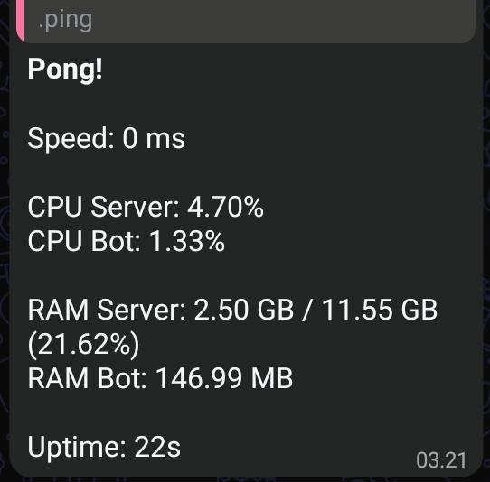
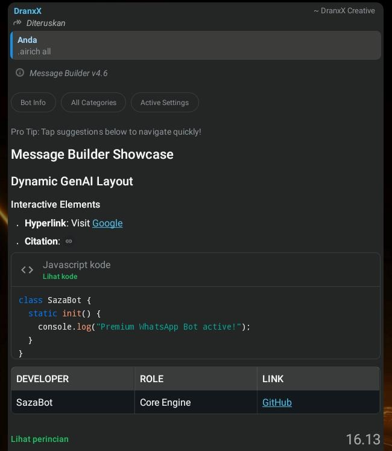

<p align="center">
  
</p>
<h1 align="center">Saza-Bot Whatsapp</h1>
<p align="center">
  WhatsApp bot dengan <strong>@baileys</strong> — Support JS + TS, Bun + npm.
  <br/>Tinggal taruh file <code>.js</code> atau <code>.ts</code> → auto-loaded. Command langsung jalan.
</p>

<p align="center">
  
  
  
  
  
  
</p>

---
[`Here for English Readme!`](README_ENG.md) 

## 📜 Apa itu Saza?

**SAZA (Smart Assistant with Zero-delay Answer)** adalah bot WhatsApp lightweight dengan arsitektur _persistent connection_ dan _multi-layer caching_. Setelah koneksi awal terbentuk, metadata grup, resolusi identitas (LID → nomor) serta plugin di-cache di memori — sehingga respons pertama sudah cepat, dan pesan selanjutnya diproses hampir tanpa delay yang terasa.

<table align="center">
  <tr>
    <td align="center">
      
      <br>
      <sub><b>Fast Answer</b></sub>
    </td>
    <td align="center">
      
      <br>
      <sub><b>Meta AI Style</b></sub>
    </td>
  </tr>
</table>


## ⚡ Dual Runtime: Bun + npm

Project ini berjalan di **Bun** dan **Node.js (npm)** tanpa perubahan kode sedikit pun. Backend SQLite otomatis mendeteksi runtime.

| | Bun | Node.js (npm) |
|---|---|---|
| **Perintah** | `bun --smol index.js` | `node index.js` |
| **SQLite** | `bun:sqlite` (bawaan, tanpa native addon) | `better-sqlite3` (addon C++) |
| **Plugin TS** | ✅ Native — `.ts` langsung jalan | ⚠️ Butuh `tsx` |
| **RAM dasar** | ~10-20MB lebih rendah (JSC vs V8) | Sedikit lebih tinggi |
| **Startup** | ~500ms | ~2-3 detik |
| **Hot reload** | `bun --watch index.js` | Pakai `nodemon` |

```bash
# Node.js (npm | recommended)
npm install
node index.js
node index.js --memlog     # + log RAM

# Bun
bun install
bun --smol index.js        # --smol = GC lebih agresif
bun --smol index.js --memlog  # + tampilkan log RAM
```

### Flag CLI

| Flag | Deskripsi |
|------|-------------|
| `--smol` | (Bun only) GC lebih agresif, mengurangi peak RAM |
| `--memlog` | Tampilkan RSS/heap/external memory di startup & after connect |

---

## 📦 Install

### Environment

- **Node.js 18+** (disarankan) atau **Bun**
- **git** (untuk clone)

```bash
git clone <repo-url> sazabot
cd sazabot
npm install          # atau: bun install
nano config.json     # isi owner, nomor bot, nama
node index.js        # atau: bun --smol index.js
```

Bot otomatis bikin direktori `db/` waktu pertama kali startup. Scan QR code di terminal (atau pakai pairing code).

### Ganti Runtime

```bash
# Bun → Node.js (npm)
rm bun.lock && npm install && npm start

# Node.js → Bun
rm package-lock.json && bun install && bun index.js
```

---

## 📖 Dokumentasi

| Dokumen | Deskripsi |
|-----|-------------|
| [`docs/id/creating-plugins.md`](docs/id/creating-plugins.md) | Panduan lengkap plugin — referensi context, kirim pesan, resolusi target, integrasi premium, before hooks, hot-reload |
| [`docs/id/airich-builder.md`](docs/id/airich-builder.md) | **AIRich** — builder rich response ala Meta AI. Format teks, code block dengan syntax highlighting, tabel, gambar, video, produk, reels, suggestions, source citations. Fluent API. |

---

## 📋 Config — `config.json`

Edit `config.json` sebelum pertama kali menjalankan. Semua field:

| Field | Tipe | Wajib | Deskripsi |
|-------|------|----------|-------------|
| `name` | string | Ya | Nama tampilan bot |
| `owner` | string | **Ya** | Nomor WhatsApp kamu — dapat akses penuh ke command owner. Tanpa `+`, tanpa spasi (contoh: `6289876543210`) |
| `bot` | string | Untuk pairing | Nomor HP bot. Dipakai untuk pairing code + deteksi owner. |
| `prefix` | string | Tidak | Awalan command, default `.` |
| `status` | string | Tidak | `public` (default) — semua chat. `ponly` — private saja. `gonly` — grup saja. `self` — hanya owner+bot. |
| `autoread` | string | Tidak | `enable` (default) — otomatis tandai pesan sudah dibaca. `disable` — biarkan belum dibaca. |
| `loginMethod` | string | Tidak | `qr` (default) — scan QR di terminal. `pairs` — kode 8 digit di aplikasi WhatsApp. |
| `pairscode` | string | Tidak | Kode kustom untuk pairing (default `SAZA-SAZA`). Hanya dipakai jika `loginMethod` = `pairs`. |
| `markdown` | boolean | Tidak | `true` (default) — WhatsApp merender `*tebal*` `_miring_` secara native. |

**Contoh:**
```json
{
  "name": "MyBot",
  "bot": "6281234567890",
  "owner": "6289876543210",
  "prefix": ".",
  "status": "public",
  "autoread": "enable",
  "loginMethod": "qr",
  "pairscode": "SAZA-SAZA",
  "markdown": true
}
```

### Metode Login

**QR Code** (default):
```
[boot] scan QR code di bawah:
▄▄▄▄▄▄▄▄▄▄▄▄▄▄▄▄▄▄▄▄▄▄▄▄▄▄▄
█ ▄▄▄▄▄ █ ▀▀▄ ██▄██ ▄▄▄▄▄ █
█ █   █ ███ ▄▄ ▄  █ █   █ █
█ █▄▄▄█ █ ▄▄ █▄▄███ █▄▄▄█ █
█▄▄▄▄▄▄▄█ █ ▀ █▄▀ █▄▄▄▄▄▄▄█
█   ██ ▄█   █▄▄█▀ ▄▄ ▄█▀  █
██▀▀▀██▄▄▄▀█▄▀█ ▄█▄ ▄▄ █▀▄█
██▄▀█▄▄▄ █ █  █▀  ▀ ▄█▄█▄ █
█▄▄ ▀ ▀▄▄▄▄▄  █▄ ▄ █ ▄█▄▀ █
█▄▄▄██▄▄▄▀▄█ ▀██  ▄▄▄  ▀ ▄█
█ ▄▄▄▄▄ █▀▄█▄█▄▀▀ █▄█ ▀▄▀ █
█ █   █ ██  ▀ ██▄▄▄▄  ▄▄ ██
█ █▄▄▄█ █  ▀▄ ▄ █▄▄█▀  █▄▄█
█▄▄▄▄▄▄▄█▄▄▄▄████▄▄▄██▄██▄█
...
```
WhatsApp → Setelan → Perangkat Tertaut → Tautkan Perangkat → scan.

**Pairing Code:**
```
[boot] pairing code: SAZA-SAZA
[boot] masukkan kode ini di WhatsApp → Perangkat Tertaut
```


### Nomor Owner

Nomor `owner` adalah cara bot mengenali kamu. Fungsinya:
- **Linked Devices (LID):** Bot otomatis resolve LID → nomor HP lewat signal repository WhatsApp. Kamu tidak perlu cari LID sendiri.
- **Grup:** Menggunakan `participantAlt` untuk identifikasi pengirim yang benar.
- **Banyak akun:** Jika kamu punya beberapa perangkat tertaut, bot mencocokkan berdasarkan nomor HP di semua alias.

---

## 📋 Command

| Command | Kategori | Deskripsi |
|---------|----------|-------------|
| `.ping` | utility | Kecepatan, CPU, RAM |
| `.menu` / `.help` | info | Daftar command per kategori |
| `.profile` | info | Status premium + kredit kamu |
| `.msgbuild` / `.airich` | info | Inspeksi message builder |
| `$ <command>` | owner | Execute terminal commands (owner only) |
| `.set <public\|self\|ponly\|gonly>` | owner | Ubah mode status |
| `.setp <prefix>` / `.setprefix` | owner | Ubah prefix command |
| `.ban <target> [durasi]` | owner | Ban user (d/m/j/h, default permanen) |
| `.unban <target>` | owner | Unban user |
| `.listban` / `.banlist` | owner | Tampilkan semua user yang di-ban |
| `.addprem <target> [durasi]` | owner | Tambah user premium |
| `.delprem <target>` | owner | Hapus user premium |
| `.listprem` | owner | Tampilkan semua user premium |
| `.hello` / `.hi` | info | Demo plugin TypeScript |

---

### Format Log

Pesan ditandai berdasarkan tipe di konsol:

| Tag | Tipe Pesan | Mengeksekusi Command? |
|-----|-------------|---------------------|
| `[msg]` | Teks percakapan / extended text | ✅ Ya |
| `[react]` | Reaction emoji (🍥) | ❌ Dilewati |
| `[sticker]` | Stiker | ❌ Dilewati |
| `[img]` | Gambar dengan caption | ✅ Ya (caption) |
| `[vid]` | Video dengan caption | ✅ Ya (caption) |
| `[audio]` | Voice note | ❌ Dilewati |
| `[doc]` | Dokumen dengan caption | ✅ Ya (caption) |
| `[self]` | Pesan dari HP bot sendiri | ❌ Tanpa eksekusi command |

---

### Sistem Ban (`lib/banStore.js`)

Berbasis SQLite dengan pencocokan multi-alias (JID + LID + nomor HP). Ban kedaluwarsa otomatis dibersihkan saat dibaca.

**Command:** `.ban @user [durasi]` \| `.unban @user` \| `.listban`

```text
.ban @user 1j       → ban selama 1 jam
.ban @user 30m      → ban selama 30 menit
.ban @user 7h       → ban selama 7 hari
.ban @user          → ban permanen
.unban @user        → hapus ban
```

Target melalui: reply pesan user, mention `@user`, atau ketik nomornya langsung.

### Sistem Premium (`lib/premiumStore.js`)

Berbasis SQLite dengan 10 kredit/bulan. Kredit otomatis reset saat pertama diakses setelah batas bulan (lazy reset — tanpa cron). Pencocokan multi-alias.

**Command:** `.addprem @user [durasi]` \| `.delprem @user` \| `.listprem`

```text
.addprem @user 30h  → premium 30 hari, 10 kredit
.addprem @user      → premium permanen
.listprem           → tampilkan semua user premium dengan kredit
```
---

### Manajemen Session (`lib/sqlite-auth.js`)

- Session disimpan di `db/session/session.db` (SQLite, satu file)
- Saat logout: otomatis bersihkan session, reconnect, tampilkan QR baru
- **Bad MAC recovery:** Jika kunci enkripsi corrupt (Bad MAC error), bot otomatis clear session & tampilkan QR baru — tanpa restart manual
- Exponential backoff: 3dtk → 6dtk → 12dtk → ... → maks 60dtk
- Reconnect di-debounce: mencegah duplikasi loop reconnect
- File WAL + SHM otomatis dibersihkan saat session di-reset

---

## 💾 RAM & Performa

Baileys (library WhatsApp Web) mendominasi memori di ~80-150MB terlepas dari runtime. Keunggulan Bun:

| Aspek | Penghematan |
|------|---------|
| Baseline JSC vs V8 | ~10-20MB lebih rendah |
| `bun:sqlite` vs `better-sqlite3` | Tanpa overhead native addon |
| Flag `--smol` | GC lebih agresif, peak lebih rendah |
| `generateHighQualityLinkPreview: false` | Hindari loading dependency pemrosesan gambar |

Untuk kebanyakan bot, perbedaan RAM tidak terlalu besar karena state kripto Baileys adalah bottleneck. Keunggulan utama Bun adalah **kecepatan startup** (~500ms vs 2-3 detik) dan **dukungan TS native**.

---

## 📁 Struktur Direktori

```
template-jsts-bun/
├── index.js                 # Entry point — connect, reconnect, message loop
├── handler.js               # Pipeline pesan — dispatch command, cek ban
├── config.json              # Pengaturan bot
├── package.json             # Script dual Bun + npm
├── README.md
│
├── db/                      # Database SQLite (auto-created)
│   ├── session/session.db   # Session multi-device WhatsApp
│   ├── banned/banned.db     # Daftar banned
│   └── premium/premium.db   # Pengguna premium
│
├── lib/
│   ├── sqlite.js            # Wrapper SQLite — auto deteksi Bun/Node
│   ├── sqlite-auth.js       # Auth state Baileys via SQLite
│   ├── messages.js          # Parser pesan + helper (.reply/.react/.delete)
│   ├── messageBuilder.js    # Builder pesan interaktif
│   ├── pluginLoader.js      # Scanner JS+TS + hot-reload chokidar
│   ├── config.js            # Loader & simpan config
│   ├── banStore.js          # Sistem ban (SQLite)
│   └── premiumStore.js      # Sistem premium (SQLite)
│
└── plugins/
    ├── hello.ts             # Demo plugin TypeScript
    ├── utility-ping.js      # .ping .stats .status
    ├── info-menu.js         # .menu .help
    ├── info-profile.js      # .profile
    ├── info-msgbuild.js     # .msgbuild .airich
    ├── owner-ban.js         # .ban .unban .listban
    ├── owner-premium.js     # .addprem .delprem .listprem
    ├── owner-exec.js        # $ (shell exec, owner only)
    ├── owner-set.js         # .set (mode status)
    ├── owner-setprefix.js   # .setp .setprefix
    └── hidden-autorespon.js # Auto-react (before hook)
```

---

## 🏗 Arsitektur

### Alur Startup

```
start()
  ├── loadAllPlugins()          → scan plugins/*.js + plugins/*.ts
  ├── watchPlugins()            → hot-reload chokidar (add/change/unlink)
  └── connect()
        ├── fetchLatestBaileysVersion()   → versi protokol
        ├── useSQLiteAuthState()          → session dari db/session/
        ├── makeWASocket()                → socket Baileys v7 WhatsApp Web
        │     ├── makeCacheableSignalKeyStore()  → kompat Bun (kunci async)
        │     └── generateHighQualityLinkPreview: false  → hemat RAM
        └── sock.ev handler
              ├── connection.update  → QR, loggedOut, reconnect
              ├── messages.upsert    → Messages() → msgHandler()
              ├── messages.update    → (internal)
              └── call               → auto-tolak
```

### Pipeline Pesan

```
Pesan masuk (messages.upsert, type: notify)
  │
  ├── Lewati jika >60 detik, status@broadcast, atau tidak ada remoteJid
  ├── Buka wrappers ephemeral / viewOnce / documentWithCaption
  └── Wrapper Messages()
        ├── Resolve pengirim (participantAlt untuk grup, LID→phone)
        ├── Ekstrak teks / caption / konten reaction
        ├── Bangun quoted message jika ada
        └── Pasang helper .reply() .react() .delete()
              │
              ▼
        msgHandler()
          ├── Filter status (public / ponly / gonly / self)
          ├── Resolusi LID → phone (di-cache)
          ├── Deteksi owner (fromMe || cocok nomor)
          ├── Cek ban (silent drop jika dibanned)
          ├── Jalankan semua before() hooks plugin
          ├── Deteksi prefix (prefix atau "$ " untuk owner)
          ├── Pencarian plugin
          ├── Guard konkurensi AI (jika category: ai)
          └── Eksekusi plugin.handler(message, ctx)
```


## 📄 Lisensi & Kredit

MIT — Bebas untuk penggunaan pribadi & komersial. Base dibuat oleh **DranxX Creative** dengan kontributor **RizzyFuzzy**.

Didukung oleh [Baileys](https://github.com/WhiskeySockets/Baileys) v7 · SQLite via `bun:sqlite` / `better-sqlite3`
